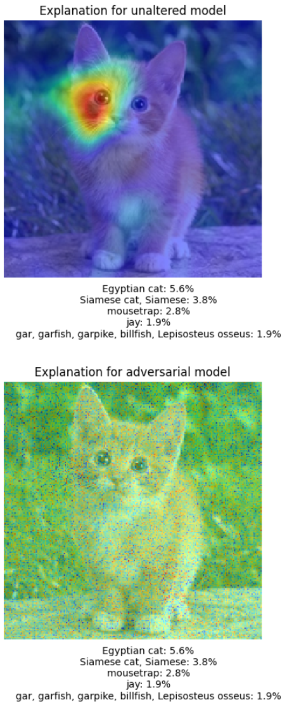

## Proof-of-Concept Unexplainable ResNet-50 Model
This GitHub repo stores the code associated with [this blog post](https://ciotinga.com), which showcases a ResNet-50 model that cannot be explained by black-box saliency map generation technique RISE. A more in-depth write-up is provided in the blog post, but examples of a saliency map generated for a traditional ResNet-50 model (top) and adversarial ResNet-50 model (bottom, this repo's showcase) are shown below.

### Instructions
The notebook provided is fairly well documented and self-explanatory, but you must [download the model from HuggingFace](https://huggingface.co/AdrianCiotinga/unexplainable_resnet50/tree/main) to run it!

